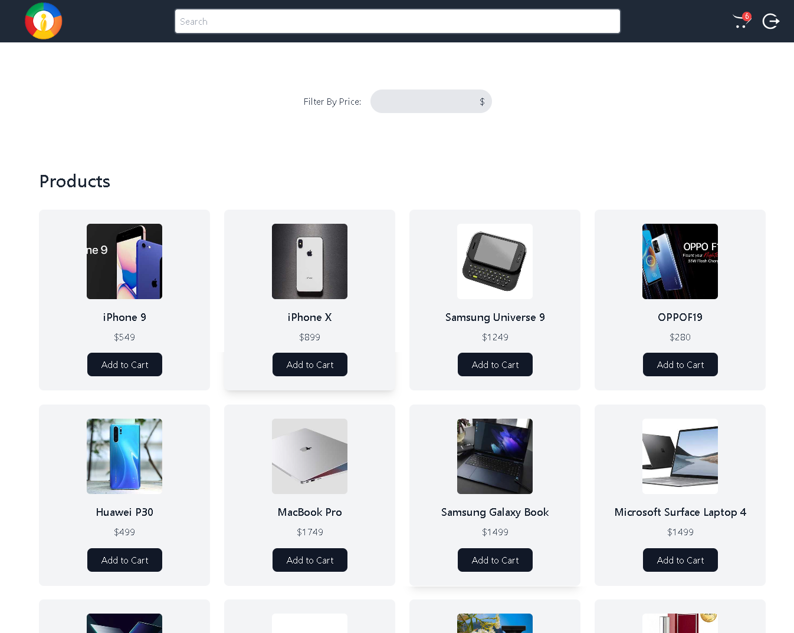

# E-commerce Web Application



This project is an E-commerce web application built using React.js, allowing users to browse through products, add and remove them from their cart, . It features a responsive design, allowing for seamless user experience across various devices.

## Features
- **User Authentication**: Ability to log in and log out (not implemented in the provided code).
- **Product Listing**: Display a list of products fetched from an external API https://dummyjson.com.
- **Filtering**: Users can filter products based on price range.
- **Search**: Search functionality to find products by title.
- **Add to Cart**: Users can add products to their shopping cart.
- **View Cart**: Display the items currently in the cart with their quantities and total amount.


## Technologies Used

- **React.js**: Frontend library for building user interfaces.
- **React Route**r: For handling navigation within the application.
- **RESTful API**: Integration with external APIs for fetching product data.
- **HTML/CSS**: Basic markup and styling.
- **JavaScript (ES6+)**: Programming language for client-side logic.
- **Git**: Version control system for tracking changes.
- **GitHub**: Hosting repository and collaboration.

**Installation**
- Clone the repository to your local machine using the following command:
    ```bash
    git clone https://github.com/your-username/your-repository.git
    ```
- Navigate to the project directory:
    ```bash
    cd e-commerce-web-app
    ```
- Install dependencies:
    ```bash
    npm install
    ```
- Start the development server:
    ```bash
    npm start
    ```
- Open your browser and visit http://localhost:3000 to view the application.

**Usage**
- Browse through the products listed on the home page.
- Use the filter options to narrow down products based on price range.
- Use the search bar to find products by title.
- Click on the "Add to Cart" button to add products to your cart.
- View your cart by clicking on the cart icon in the header.

**Deployment**
This project can be deployed to various hosting platforms such as Netlify, Vercel, or GitHub Pages. Follow the deployment instructions provided by the hosting platform of your choice.

**Credits**
- DummyJSON: Used for generating mock product data.
- React.js: Frontend library for building user interfaces.
- React Router: For handling navigation within the application.
- FontAwesome and React Icons: Used for icons in the application.
- And other open-source libraries and resources used in the project.


## 🔗 Social Links:

| [](https://www.linkedin.com/in/almaskhann/) | [](https://twitter.com/almas_khan1286) |
| --- | --- |
